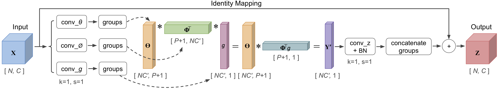

# Compact Generalized Non-local Network

By [Kaiyu Yue](http://kaiyuyue.com), [Ming Sun](https://msunming.github.io/), [Yuchen Yuan](https://scholar.google.com.au/citations?user=QJAr1KoAAAAJ&hl=en), [Feng Zhou](http://www.f-zhou.com/bio.html), Errui Ding and Fuxin Xu

## Introduction

This is a [PyTorch](https://pytorch.org/) re-implementation for the paper [Compact Generalized Non-local Network](https://arxiv.org/abs/1810.13125). It brings the CGNL models trained on the [CUB-200](http://www.vision.caltech.edu/visipedia/CUB-200.html), [ImageNet](http://image-net.org/index) and [COCO](http://cocodataset.org/) based on [maskrcnn-benchmark](https://github.com/facebookresearch/maskrcnn-benchmark) from FAIR.



## Update

- 05/2019: Support CGNL & NL Module in Caffe - see [`caffe/README.md`](./caffe/README.md)

## Citation

If you think this code is useful in your research or wish to refer to the baseline results published in our paper, please use the following BibTeX entry.

```
@article{CGNLNetwork2018,
    author={Kaiyu Yue and Ming Sun and Yuchen Yuan and Feng Zhou and Errui Ding and Fuxin Xu},
    title={Compact Generalized Non-local Network},
    journal={NIPS},
    year={2018}
}
```

## Requirements

  * PyTorch >= 0.4.1 or 1.0 from a nightly release
  * Python >= 3.5
  * torchvision >= 0.2.1
  * termcolor >= 1.1.0

## Environment

The code is developed and tested under 8 Tesla P40 / V100-SXM2-16GB GPUS cards on CentOS with installed CUDA-9.2/8.0 and cuDNN-7.1.

## Baselines and Main Results on CUB-200 Dataset

| File ID    | Model                | Best Top-1 (%) | Top-5 (%) | Google Drive | Baidu Pan |
|:---------- |:-------------------- |:--------------:|:---------:|:------------:|:---------:|
| 1832260500 | R-50 Base            | 86.45          | 97.00     | [`link`](https://drive.google.com/file/d/1nk1y6YE5A-jcuxC5r-hdnU0B5dny8Nf2/view?usp=sharing)     | [`link`](https://pan.baidu.com/s/1QB4GLaq0rY9C7psItj8IdA) |
| 1832260501 | R-50 w/ 1 NL Block    | 86.69          | 96.95     | [`link`](https://drive.google.com/file/d/1r15lAheWPHyo4V9aitceyG6h-rEPwzun/view?usp=sharing)     | [`link`](https://pan.baidu.com/s/1UERXF48oM8MKRfhRFdrHFw)  |
| 1832260502 | R-50 w/ 1 CGNL Block  | 87.06          | 96.91     | [`link`](https://drive.google.com/file/d/1XND1fPWCzlYTsfiggiZqYhFREAZ-DVTK/view?usp=sharing)     | [`link`](https://pan.baidu.com/s/1onJlxgEhQxTVwUdHVmNXRA)  |
| 1832261010 | R-101 Base           | 86.76          | 96.91     | [`link`](https://drive.google.com/file/d/1mZPz9E3eEwmusEBD-zpjrL6IceM8kxOq/view?usp=sharing)     | [`link`](https://pan.baidu.com/s/1NWTbRny-Qs6_7Ts40RkeAQ)  |
| 1832261011 | R-101 w/ 1 NL Block   | 87.04          | 97.01     | [`link`](https://drive.google.com/file/d/1eYKqnFxSVfCM_5qeTeiEG69PteaQZ3DT/view?usp=sharing)     | [`link`](https://pan.baidu.com/s/1JFu5JRjNo9drQZkDeZzPxw)  |
| 1832261012 | R-101 w/ 1 CGNL Block | 87.28          | 97.20     | [`link`](https://drive.google.com/file/d/1oiRzne2nhS4aUwLWr3DzS7ke3D6HYMZ2/view?usp=sharing)     | [`link`](https://pan.baidu.com/s/1iTMZPd2BuXcyZl56sEWUrA)  |

### Notes:
  - The input size is 448.
  - The CGNL block with dot production kernel is configured within 8 groups.

| File ID     | Model                  | Best Top-1 (%) | Top-5 (%) | Google Drive | Baidu Pan |
|:----------- |:---------------------- |:--------------:|:---------:|:------------:|:---------:|
| 1832260503x | R-50 w/ 1 CGNLx Block   | 86.56          | 96.63     | [`link`](https://drive.google.com/file/d/1grkSRJfojIECZs85abvfelnxnVleSLlJ/view?usp=sharing)     | [`link`](https://pan.baidu.com/s/1RisiSxWMBjVDnhxeM2Ddaw)  |
| 1832261013x | R-101 w/ 1 CGNLx Block  | 87.18          | 97.03     | [`link`](https://drive.google.com/file/d/1AZPZk4IvmsbT6jcm0An_V249IbGK8ml6/view?usp=sharing)     | [`link`](https://pan.baidu.com/s/1FHhhGrj8qJe1bLMFeDClwQ)  |

### Notes:
  - The input size is 448.
  - The CGNLx block with Gaussian RBF \[[0](#reference)\]\[[1](#reference)\] kernel is configured within 8 groups.
  - The Taylor Expansion order for the kernel function is 3.

## Experiments on ImageNet Dataset

| File ID     | Model                | Best Top-1 (%) | Top-5 (%) | Google Drive | Baidu Pan |
|:----------- |:-------------------- |:--------------:|:---------:|:------------:|:---------:|
| [torchvision](https://github.com/pytorch/vision/blob/master/torchvision/models/resnet.py#L12) | R-50 Base  | 76.15 | 92.87 | - | - |
| 1832261502  | R-50 w/ 1 CGNL Block  | 77.69          | 93.63     | [`link`](https://drive.google.com/file/d/1ezE6_tblZdoFZTYw24NJIaP_A5E0xduS/view?usp=sharing)     | [`link`](https://pan.baidu.com/s/1105xXRHxeU_gMC0Mv-EU4w)  |
| 1832261503  | R-50 w/ 1 CGNLx Block | 77.32          | 93.40     | [`link`](https://drive.google.com/file/d/1HSqYZvL8EOiQO47dqasZTVpufLjwtg0-/view?usp=sharing)     | [`link`](https://pan.baidu.com/s/1GVQwUzDln3rCOBL8_ACJWg)  |
| [torchvision](https://github.com/pytorch/vision/blob/master/torchvision/models/resnet.py#L14) | R-152 Base | 78.31 | 94.06 | - | - |
| 1832261522  | R-152 w/ 1 CGNL Block | 79.53          | 94.52     | [`link`](https://drive.google.com/file/d/1UKfwi3_Egj_pxFDcCV4sdQjFrb5dyDH2/view?usp=sharing)     | [`link`](https://pan.baidu.com/s/1tgJkWSfj9WlyqpXvRGDTig)  |
| 1832261523  | R-152 w/ 1 CGNLx Block| 79.37          | 94.47     | [`link`](https://drive.google.com/file/d/14XsJta6FevDDvZG9evKAXeXj6dKG-lZJ/view?usp=sharing)     | [`link`](https://pan.baidu.com/s/1kLBL6vsteq-wlj6XlIVqug)  |

### Notes:
  - The input size is 224.
  - The CGNL and CGNLx blocks are configured as same as above experiments on CUB-200.

## Experiments on COCO based on Mask R-CNN in PyTorch 1.0

| backbone                | type | lr sched | im / gpu | train mem(GB) | train time (s/iter) | total train time(hr) | inference time(s/im) | box AP | mask AP | model id | Google Drive | Baidu Pan  |
| ----------------------- | ---- | -------- | -------- | ------------- | ------------------- | -------------------- | -------------------- | ------ | ------- |:--------:|:------------:|:----------:|
| R-50-C4                 | Mask | 1x       | 1        | 5.641         | 0.5434              | 27.3                 | 0.18329 + 0.011      | 35.6   | 31.5    | [6358801](https://download.pytorch.org/models/maskrcnn/e2e_mask_rcnn_R_50_C4_1x.pth) | - | - |
| R-50-C4 w/ 1 CGNL Block | Mask | 1x       | 1        | 5.868         | 0.5785              | 28.5                 | 0.20326 + 0.008      | 36.3   | 32.1    | -  | [`link`](https://drive.google.com/file/d/1n1hVs2r0FIbsiZyQAQkwxGYtYhpq5RjH/view?usp=sharing)   | [`link`](https://pan.baidu.com/s/18Yl5MRGzniNpMxfwKUFu7g) |
| R-50-C4 w/ 1 CGNLx Block| Mask | <details><summary>s1x</summary>`_C.SOLVER.WARMUP_ITERS = 20000`<br/>`STEPS: (140000, 180000)`<br/>`MAX_ITER: 200000`</details>        | 1        | 5.977         | 0.5855              | 32.3                 | 0.18571 + 0.010      | 36.2   | 31.9    | -  | [`link`](https://drive.google.com/file/d/1oiSCFd7N_ULpexIYfE5uZ53q5ytmhKbj/view?usp=sharing)   | [`link`](https://pan.baidu.com/s/1C_8UneEHnt-jfHx9TWeVwQ) |

### Notes:
  - The CGNL model is simply trained using the same experimental strategy as in [maskrcnn-benchmark](https://github.com/facebookresearch/maskrcnn-benchmark). It is configured as same as above experiments on CUB-200.
  - If you want to add the `CGNL` / `CGNLx` / `NL` blocks to the backbone of Mask-RCNN models, you can use the `maskrcnn-benchmark/modeling/backbone/resnet.py` and `maskrcnn-benchmark/utils/c2_model_loading.py` to replace the original py-files. Please refer to the code for specific configurations.
  - Prolonging the `WARMUP_ITERS` appropriately would produce the better results for CGNL models. The long training schedule is also recommended, like `2x` or `1.44x` in [Detectron](https://github.com/facebookresearch/Detectron/blob/master/MODEL_ZOO.md#training-schedules).
  - Due to some reasons of the Linux virtual environment or the data I/O speed, the numbers of `train time`, `total train time` and `inference time` in above table are both larger than the benchmarks. But this does not affect the demonstration of the efficiency of CGNL block.

## Getting Start

### Prepare Dataset

  - Download pytorch imagenet pretrained models from [pytorch model zoo](https://pytorch.org/docs/stable/model_zoo.html#module-torch.utils.model_zoo). The optional download links can be found in [torchvision](https://github.com/pytorch/vision/tree/master/torchvision/models). Put them in the `pretrained` folder.

  - Download the training and validation lists for CUB-200 dataset from [Google Drive](https://drive.google.com/file/d/1coklkMoDeFy-JHVhHtmbcrxFLjn7ndrJ/view?usp=sharing) or [Baidu Pan](https://pan.baidu.com/s/1rhGlTxZWBn38j6JoDWPwwA). Download the ImageNet dataset and move validation images to labeled subfolders following the [tutorial](https://github.com/pytorch/examples/tree/master/imagenet). The training and validation lists can be found in [Google Drive](https://drive.google.com/file/d/1Qy1zYUUSY5v_13XcjcXYBhlqb2ofdw_v/view?usp=sharing) or [Baidu Pan](https://pan.baidu.com/s/1QjNgBaAKOYUseW8ygC_-hw). Put them in the `data` folder and make them look like:

    ```
    ${THIS REPO ROOT}
     `-- pretrained
         |-- resnet50-19c8e357.pth
         |-- resnet101-5d3b4d8f.pth
         |-- resnet152-b121ed2d.pth
     `-- data
         `-- cub
             `-- images
             |   |-- 001.Black_footed_Albatross
             |   |-- 002.Laysan_Albatross
             |   |-- ...
             |   |-- 200.Common_Yellowthroat
             |-- cub_train.list
             |-- cub_val.list
             |-- images.txt
             |-- image_class_labels.txt
             |-- README
         `-- imagenet
             `-- img_train
             |   |-- n01440764
             |   |-- n01734418
             |   |-- ...
             |   |-- n15075141
             `-- img_val
             |   |-- n01440764
             |   |-- n01734418
             |   |-- ...
             |   |-- n15075141
             |-- imagenet_train.list
             |-- imagenet_val.list
    ```

### Perform Validating

```bash
$ python train_val.py --arch '50' --dataset 'cub' --nl-type 'cgnl' --nl-num 1 --checkpoints ${FOLDER_DIR} --valid
```

### Perform Training Baselines

```bash
$ python train_val.py --arch '50' --dataset 'cub' --nl-num 0
```

### Perform Training NL and CGNL Networks

```bash
$ python train_val.py --arch '50' --dataset 'cub' --nl-type 'cgnl' --nl-num 1 --warmup
```

## Reference
  * \[0\] Y. Cui et al, [Kernel Pooling for Convolutional Neural Networks](http://openaccess.thecvf.com/content_cvpr_2017/html/Cui_Kernel_Pooling_for_CVPR_2017_paper.html), CVPR 2017. 
  * \[1\] T. Poggio et al, [Networks for Approximation and Learning](https://ieeexplore.ieee.org/document/58326), Proceedings of the IEEE 1990.

## License

This code is released under the MIT License. See [LICENSE](LICENSE) for additional details.